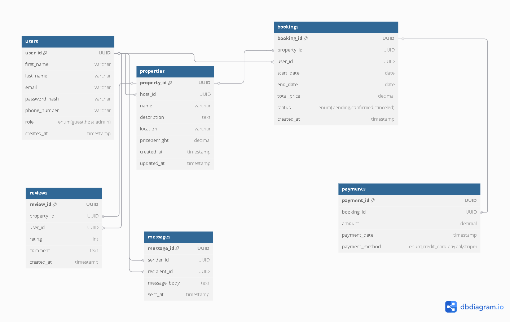

# ER Diagram Requirements

## Project: ALX Airbnb Database Design

This document outlines the entity-relationship diagram (ERD) created for the ALX Airbnb-style database project. The ERD provides a visual and logical representation of the key entities, their attributes, and relationships within the system.

---

## 1. Purpose of the ER Diagram

The goal of this ER diagram is to design a normalized, scalable, and real-world relational database schema that models the core components of an Airbnb-like application. The design supports the following use cases:

- User registration and role management (guest, host, admin).
- Property listings and management by hosts.
- Booking flow for guests.
- Secure and trackable payment processing.
- Review and rating system.
- Messaging system between users.

---

## 2. Entities and Attributes

Below are the key entities identified in the system, along with their major attributes:

### 🧑 User
- `id`: Primary key.
- `name`: Full name of the user.
- `email`: Unique user email.
- `password`: Hashed password for login.
- `role`: Role type (guest, host, admin).
- `created_at`: Timestamp of account creation.

### 🏠 Property
- `id`: Primary key.
- `user_id`: Foreign key referencing `User(id)`, indicating the host.
- `title`: Title of the listing.
- `description`: Detailed description of the property.
- `address`: Physical location.
- `price_per_night`: Rental price per night.
- `created_at`: Timestamp of listing creation.

### 📅 Booking
- `id`: Primary key.
- `user_id`: Foreign key referencing `User(id)`, indicating the guest.
- `property_id`: Foreign key referencing `Property(id)`.
- `start_date`: Start of stay.
- `end_date`: End of stay.
- `total_price`: Total booking cost.
- `status`: Booking status (pending, confirmed, cancelled).

### 💳 Payment
- `id`: Primary key.
- `booking_id`: Foreign key referencing `Booking(id)`.
- `amount`: Payment amount.
- `payment_method`: Payment method (card, PayPal, etc.).
- `payment_date`: Date of payment.

### 🌟 Review
- `id`: Primary key.
- `booking_id`: Foreign key referencing `Booking(id)`.
- `rating`: Rating (1 to 5).
- `comment`: Optional user comment.
- `created_at`: Timestamp of review.

### 💬 Message
- `id`: Primary key.
- `sender_id`: Foreign key referencing `User(id)`.
- `receiver_id`: Foreign key referencing `User(id)`.
- `content`: Message body.
- `sent_at`: Timestamp of when the message was sent.

---

## 3. Relationships

### 🔄 User to Property
- **Type:** One-to-Many
- **Description:** A user (host) can create multiple property listings.
- **Mandatory?:** Optional – not all users are hosts.

### 🔄 User to Booking
- **Type:** One-to-Many
- **Description:** A user (guest) can make multiple bookings.
- **Mandatory?:** Optional – not all users book properties.

### 🔄 Property to Booking
- **Type:** One-to-Many
- **Description:** Each property can have many bookings.
- **Mandatory?:** Optional – not all properties are booked.

### 🔄 Booking to Payment
- **Type:** One-to-One
- **Description:** Each booking must be associated with one payment.
- **Mandatory?:** Yes – payments are required for bookings.

### 🔄 Booking to Review
- **Type:** One-to-One
- **Description:** A booking may have one review.
- **Mandatory?:** No – reviews are optional.

### 🔄 User to Message (Sender/Receiver)
- **Type:** One-to-Many (Sender → Messages), One-to-Many (Receiver → Messages)
- **Description:** Users can send and receive messages with other users.
- **Mandatory?:** Optional – not all users communicate.

---

## 4. Normalization Overview

All entities are normalized up to the **Third Normal Form (3NF)** to ensure:
- No partial dependencies.
- No transitive dependencies.
- Data redundancy is minimized.
- Data integrity is preserved.

Each table contains atomic attributes, has a clear primary key, and foreign keys are used to define relationships appropriately.

---

## 5. ERD File

The ER diagram is provided in the following formats:
- `airbnb_erd.drawio` – Editable diagram (Draw.io format)
- `airbnb_erd.png` – Static image for quick reference

> 📁 Location: `alx-airbnb-database/ERD/`

---

## 6. Tools Used

- **dbdiagram.io**: Used for quick schema-based modeling and generating ER diagrams using SQL-like syntax.

---

